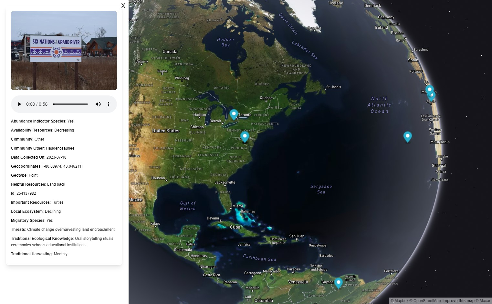
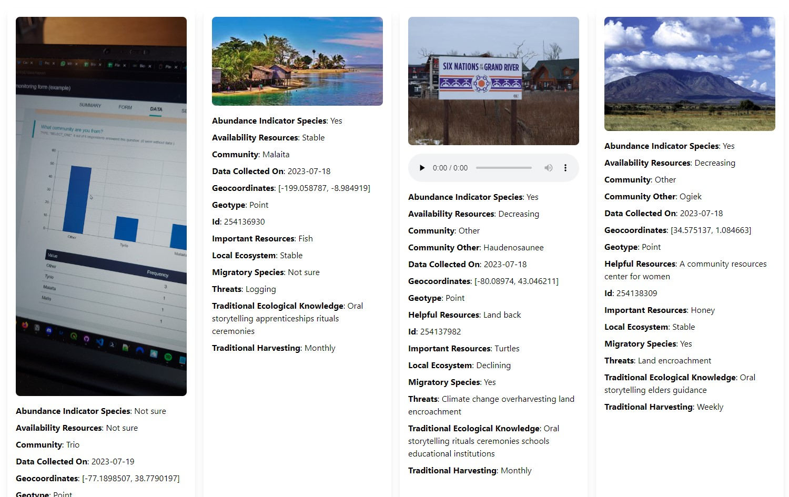
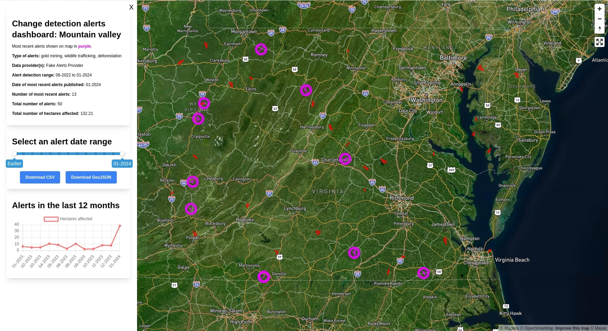

# GuardianConnector Explorer

<p align="center">
  
</p>

This tool, designed for [GuardianConnector](https://guardianconnector.net) and built using [Nuxt.js](https://nuxt.com/), offers an API compatible with a PostgreSQL databases, and renders tabular data from one or more tables on different views including a map and a media gallery.

## Configure

To get started, copy `.env.example` to `.env` and add your database and table information, authentication, and a Mapbox access token.

**Database:** Provide your database information in the relevant variables.

**Authentication strategy:** GuardianConnector Explorer supports three different authentication strategies: auth0, password (from an environmental var) with JWT key, or none. Set your authentication strategy in `NUXT_PUBLIC_AUTH_STRATEGY`.

- If you are using an auth0 strategy, then you need to provide a domain, client ID, client secret, audience, and base URL.

**Nuxt App API key:** Generate an API key to add to request headers made by the Nuxt front end. You can generate one by running `openssl rand -base64 42`.

**Views configuration:** GuardianConnector Explorer can render multiple tables and you can determine which views to show for each table. To configure your tables and views, access the `/config` route once the application has started. For more information on this, please see [config.md](docs/config.md). You do not need to set this in order for GuardianConnector Explorer to start, however the index page will show an empty list and none of the view routes will load anything.

## Build Setup

```bash
# install dependencies
$ pnpm install

# serve with hot reload at localhost:8080
$ pnpm dev

# build for production and launch server
$ pnpm build
$ pnpm start

# generate static project
$ pnpm generate
```

Add `--hostname 0.0.0.0` if you want the app to be accessible across your local network.

## Database

This application uses [Drizzle ORM](https://orm.drizzle.team/) for database operations and migrations.

### Migrations

Database migrations can be run in several ways:

**Development:**

```bash
# Generate new migration files
$ pnpm db:generate

# Apply migrations to database
$ pnpm db:migrate

# Open Drizzle Studio (database GUI)
$ pnpm db:studio
```

**Production (Docker):**
Migrations run automatically when the container starts using the `migrate-and-start.sh` script.

**CI/Testing:**
Migrations are skipped automatically when `CI=true` is set.

## Deployment

For deployment, the following additional env vars are needed:

```
HOST: 0.0.0.0
NODE_ENV: production
```

Local deployment of Docker:

```sh
docker run --env-file=.env -it -p 8080:8080 guardianconnector-explorer:latest
```

## Testing

GuardianConnector Explorer uses two testing frameworks:

### 1. Unit and Component Tests (Vitest)

Run unit and component tests with Vitest:

```bash
# Run tests in watch mode
$ pnpm test:unit
```

These tests use mocked dependencies and verify component logic in isolation.

### 2. End-to-End Tests (Playwright)

Run E2E tests that verify the full application, from a real browser down to the
backend API and database, and back up.

E2E tests require a fully functional test environment. The preferred setup uses
docker-compose to spin up isolated containers for the backend and database, then runs Playwright tests separately.
This approach guarantees consistent test runs without relying on shared environments.

#### Test Execution Modes

The test setup has two modes, controlled by the `CI` environment variable:

- **CI Mode** (`CI=true`): Playwright connects to externally managed services (backend + database running in Docker containers)
- **Dev Mode** (`CI=false` or unset): Playwright starts its own Nuxt dev server and connects to your configured database

```bash
# Recommended: use the convenience script (requires .env.test.compose file)
$ ./run-local-docker-tests.sh
$ CI=true pnpm test:e2e

# Run E2E tests with isolated Docker services
$ docker compose -f docker-compose.tests.yml up -d database backend
$ CI=true pnpm test:e2e

# Run E2E tests using a specific Docker image tag
$ ImgTag=2025-01-01 docker compose -f docker-compose.tests.yml up -d database backend
$ CI=true pnpm test:e2e

# For quick development testing (starts own dev server)
$ pnpm test:e2e
```

> [!WARNING]
>
> **Dev mode** requires a database connection in `.env.test.playwright`, and for some of the e2e tests (e.g. config), it is required to write to the database. It is highly recommended to use **CI mode** with Docker containers for local testing to avoid affecting your development database, and furthermore, to NOT use production database credentials for dev mode.

#### Environment Setup

##### CI Mode (Docker Services)

**For local testing with Docker services:**

- Copy `.env.test.compose.example` to `.env.test.compose` and set all required API keys and secrets
- Use `./run-local-docker-tests.sh` script or manually start services with `docker compose -f docker-compose.tests.yml`
- When using the script, make sure to stop the services with `docker compose -f docker-compose.tests.yml down` when you are done testing.

The `docker-compose.tests.yml` takes care of:

1. Populating the test database with known mock data (stored in `db/init/warehouse.sql`), including survey and alerts views
2. Setting `NUXT_PUBLIC_AUTH_STRATEGY="none"` to bypass authentication
3. Running isolated containers that don't affect your development environment

Note: The database is ephemeral. To reload seed data, remove the volume:

```bash
docker volume rm gc-explorer_db_data
```

**For CI/GitHub Actions:**

- The workflow automatically creates `.env.test.playwright` with GitHub secrets
- Uses the same `docker-compose.tests.yml` file for consistency

##### Dev Mode (Local Development)

**For quick development testing:**

- Copy `.env.test.playwright.example` to `.env.test.playwright` and set database connection + API keys
- Playwright will start its own Nuxt dev server using `pnpm dev`
- Tests will use your configured database connection

#### Playwright Test Development

It is recommended to run tests with headless mode disabled, so that you can see the browser as it runs the tests. While developing tests, you may also want to add timeouts to the tests, so that you can see the browser as it runs the tests. (Remember to remove these timeouts before committing your changes.)

You can run specific Playwright tests by appending `.only` to the test name, or by running:

```bash
pnpm test:e2e --grep "layer visibility toggles" # change to the test you want to run
```

### CI/CD Testing

The GitHub Actions workflow automatically runs both unit and E2E tests on every push and pull request.

**Automated workflow:**

- Builds a Docker image tagged as `ci-test` for testing
- Creates `.env.test.playwright` with GitHub secrets and starts the same Docker services as local testing
- Runs unit tests with `pnpm test:unit`
- Runs E2E tests with `pnpm test:e2e` in CI mode

GitHub secrets must be configured based on the `.env.test.playwright.example` file for the workflow to succeed.

## Available Views

### **Map**


_Map view using sample KoboToolbox data, with an image and audio attachment embedded._

### **Gallery**


_Gallery view using sample KoboToolbox data._

### **Alerts (change detection)**


_Alerts dashboard view with fake alerts data._

## How it works

### Column headers

Currently, GuardianConnector expects these column headers, which follow the structure of a GeoJSON feature. You can use these [GeoJSON to SQL conversion scripts](https://github.com/rudokemper/geojson-csv-sql-conversion-tools) to transform your GeoJSON file into the expected format if needed.

| SQL Column       | GeoJSON Field        |
| ---------------- | -------------------- |
| id               | id                   |
| g\_\_type        | geometry.type        |
| g\_\_coordinates | geometry.coordinates |
| ...              | properties...        |

If found, GuardianConnector Explorer will use a column mapping SQL table (with "\_\_column" suffix), like the one created by connector scripts of [GuardianConnector Script Hub](https://github.com/ConservationMetrics/gc-scripts-hub), to handle filtering and key/value rewrites.

Any columns specified in the `.env` file will be filtered out (_see "Unwanted columns and substrings" above_).

At this time, media attachments in the popups are handled in a somewhat brittle way by embedding any strings that end in the expected photo, audio, or video file ending (such as `.jpg`, `.mp3`, or `.mp4`). We can improve on this later when we know more about how media attachments will be stored in the SQL database, and what kind of metadata we have access to.

### GeoJSON export formats for map view

The GuardianConnector Explorer map will render the feature on a map in accordance to what kind of `type` it is (Point, LineString, Polygon). The properties are shown in a popup opened by clicking on the feature.

The GuardianConnector Explorer map can work with any GeoJSON data stored in the expected tabular format, but the main purpose is to visualize field data collected using data collection applications such as (Co)Mapeo, ODK, and KoboToolbox.

- Mapeo data from Mapeo Desktop is already exported as GeoJSON file, and a CoMapeo Archive Server returns data in a GeoJSON-compliant format.
- ODK / KoboToolbox API survey data with a geospatial column may be transformed into such a format.

In the future, this app can be expanded to also supporting loading from PostGIS, or directly from file.
